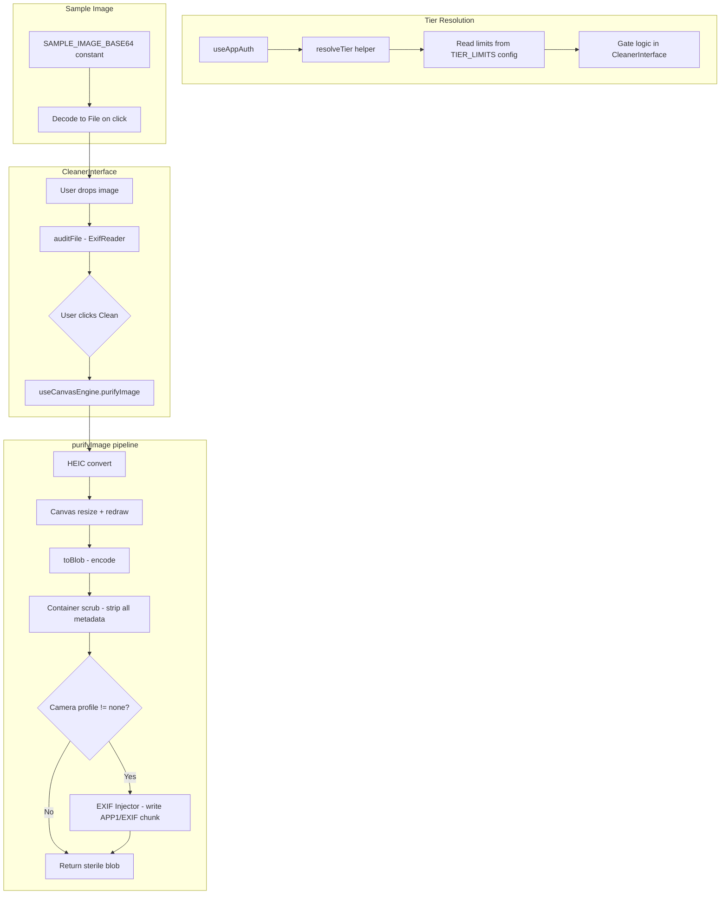

# Design Document: Workspace Improvements

## Overview

This design covers six functional areas that improve the ScrubAI workspace's robustness, correctness, and UX polish:

1. **Translation resilience** - Prevent browser translation extensions from hiding or breaking the output-format and camera-profile controls.
2. **Tier limits config** - Move all usage gate constants into `src/config/pricing.ts` and introduce a `user_free` tier (10 cleans/day) between `guest_free` (5) and `pro` (unlimited).
3. **Tier resolution** - Derive the active tier deterministically from the `useAppAuth()` state tuple `(isLoaded, isSignedIn, isPro)`.
4. **EXIF injector** - Build a minimal valid APP1/EXIF segment client-side and inject it into JPEG/WebP byte streams after the container scrub. Skip for PNG.
5. **Real sample image** - Bundle a tiny JPEG with genuine EXIF/GPS/C2PA-like metadata as a base64 constant so "Try a sample" loads real pixels.
6. **Quality slider + layout** - Confirm existing quality pass-through, disable the slider for PNG, and anchor the options block to the bottom of the left column via flexbox.

All changes are client-side only. The privacy invariant (image bytes never leave the browser) is preserved by design - every new module operates exclusively on in-memory `ArrayBuffer` and `Blob` objects.

## Architecture



### Key architectural decisions

| Decision | Rationale |
|----------|-----------|
| EXIF injection lives in a standalone module (`src/lib/exifInjector.ts`) | Keeps `useCanvasEngine` focused on pixel ops; injection is a byte-level post-process. Easier to unit-test in isolation. |
| Tier limits config is a plain object in `pricing.ts` (not a hook) | Limits are static constants - no runtime state needed. Importing a const is simpler and tree-shakes better. |
| Sample image is a base64 constant (not a fetched asset) | Guarantees zero network requests, satisfies the privacy invariant, and keeps the sample available offline. |
| Translation resilience uses `translate="no"` + class `notranslate` | These are the two standard signals respected by Google Translate, DeepL, and Safari Translate. No single-vendor dependency. |
| Quality slider disabled for PNG via `exportFormat` state check | PNG is lossless - the quality param is meaningless. Disabling communicates this clearly. |
| Options block anchored with `flex-col` + `mt-auto` on the wrapper | Native CSS flexbox - no JS layout hacks, works across all viewports. |

## Components and Interfaces

### 1. `src/config/pricing.ts` - TIER_LIMITS extension

```typescript
export type TierName = "guest_free" | "user_free" | "pro";

export interface TierLimits {
  dailyCleanLimit: number; // 0 means unlimited (pro)
  maxBatchSize: number;
  maxUploadMB: number;
}

export const TIER_LIMITS: Record<TierName, TierLimits> = {
  guest_free: { dailyCleanLimit: 5, maxBatchSize: 1, maxUploadMB: 25 },
  user_free:  { dailyCleanLimit: 10, maxBatchSize: 1, maxUploadMB: 25 },
  pro:        { dailyCleanLimit: 0, maxBatchSize: 50, maxUploadMB: 100 },
};
```

### 2. `src/lib/tierResolver.ts` - Tier resolution helper

```typescript
import { TierName } from "@/config/pricing";

interface AuthState {
  isLoaded: boolean;
  isSignedIn: boolean | undefined;
  isPro: boolean;
}

export function resolveTier(auth: AuthState): TierName {
  if (!auth.isLoaded) return "guest_free"; // most restrictive default
  if (auth.isPro) return "pro";
  if (auth.isSignedIn) return "user_free";
  return "guest_free";
}
```

### 3. `src/lib/exifInjector.ts` - EXIF injection module

```typescript
export interface ExifProfile {
  make: string;
  model: string;
  lensModel: string;
  software: string;
  dateTimeOriginal: string; // "YYYY:MM:DD HH:MM:SS"
}

export interface InjectResult {
  blob: Blob;
  injected: boolean;
  error?: string;
}

/**
 * Inject a minimal valid EXIF APP1 segment into a JPEG or WebP blob.
 * Returns the blob unchanged (with injected=false) for PNG or on error.
 */
export function injectExif(blob: Blob, profile: ExifProfile, format: ExportFormat): Promise<InjectResult>;
```

### 4. `src/lib/sampleImage.ts` - Bundled sample

```typescript
/**
 * Base64-encoded JPEG (under 50KB) carrying real EXIF, GPS, and
 * a C2PA-like JUMBF marker. Decoded into a File on demand.
 */
export const SAMPLE_IMAGE_BASE64: string;

export function createSampleFile(): File;
```

### 5. `CleanerInterface.tsx` changes

- Wrap format/profile `<select>` elements and their labels with `translate="no"` attribute and `notranslate` CSS class.
- Replace hardcoded limit constants (`5`, `50`) with `TIER_LIMITS[currentTier].dailyCleanLimit` / `.maxBatchSize`.
- Use `resolveTier()` to compute `currentTier` from auth state.
- Disable quality slider when `exportFormat === "image/png"`.
- Restructure left column as `flex flex-col` with the options wrapper getting `mt-auto`.
- Replace the fake sample image creation with `createSampleFile()`.

### 6. `useCanvasEngine.ts` changes

- After `scrubContainer`, conditionally call `injectExif` if the camera profile is not `none`.
- Accept an optional `profile` parameter in `PurifyOptions`.
- Return `InjectResult.injected` status in `PurifyResult`.

## Data Models

### TierLimits config shape

```typescript
{
  guest_free: { dailyCleanLimit: 5,  maxBatchSize: 1,  maxUploadMB: 25  },
  user_free:  { dailyCleanLimit: 10, maxBatchSize: 1,  maxUploadMB: 25  },
  pro:        { dailyCleanLimit: 0,  maxBatchSize: 50, maxUploadMB: 100 },
}
```

`dailyCleanLimit: 0` is the sentinel for "unlimited" (pro tier). Gate logic:
```
isLimitReached = limit !== 0 && count >= limit
```

### EXIF APP1 segment binary layout (JPEG injection)

```
FF E1          - APP1 marker
XX XX          - Segment length (big-endian, includes 2 length bytes + payload)
45 78 69 66 00 00  - "Exif\0\0" identifier (6 bytes)

TIFF Header:
  49 49        - Little-endian byte order ("II")
  2A 00        - TIFF magic (0x002A LE)
  08 00 00 00  - Offset to first IFD (8 bytes from TIFF start)

IFD0 (Image):
  XX XX        - Number of entries (5 entries for our profile)
  Entry: Make           (tag 0x010F, type ASCII)
  Entry: Model          (tag 0x0110, type ASCII)
  Entry: Software       (tag 0x0131, type ASCII)
  Entry: DateTime       (tag 0x0132, type ASCII, 20 bytes "YYYY:MM:DD HH:MM:SS\0")
  Entry: ExifIFD ptr    (tag 0x8769, type LONG, offset to Sub-IFD)
  00 00 00 00  - Next IFD offset (0 = no more IFDs)

Sub-IFD (Exif):
  XX XX        - Number of entries (2)
  Entry: LensModel         (tag 0xA434, type ASCII)
  Entry: DateTimeOriginal  (tag 0x9003, type ASCII, 20 bytes)
  00 00 00 00  - Next IFD offset (0)

String data area:
  (ASCII values referenced by IFD entries, null-terminated)
```

### WebP EXIF chunk injection

```
"EXIF"         - FourCC (4 bytes)
XX XX XX XX    - Chunk size (little-endian, excludes header)
<TIFF payload> - Same TIFF header + IFDs as above (no "Exif\0\0" prefix)
[pad byte]     - If size is odd, one 0x00 pad
```

Additionally, set bit 3 (EXIF present) in the VP8X feature flags byte.

### Camera profile constants

```typescript
export const CAMERA_PROFILES: Record<string, ExifProfile> = {
  iphone: {
    make: "Apple",
    model: "iPhone 15 Pro",
    lensModel: "iPhone 15 Pro back camera 6.86mm f/1.78",
    software: "17.4.1",
    dateTimeOriginal: "", // filled at injection time
  },
  canon: {
    make: "Canon",
    model: "Canon EOS 5D Mark IV",
    lensModel: "EF24-70mm f/2.8L II USM",
    software: "Firmware Version 1.4.0",
    dateTimeOriginal: "",
  },
  sony: {
    make: "Sony",
    model: "ILCE-7RM5",
    lensModel: "FE 24-70mm F2.8 GM II",
    software: "ILCE-7RM5 v2.00",
    dateTimeOriginal: "",
  },
};
```

### Sample image metadata baked-in

The bundled JPEG carries these tags (written by a build script or hand-crafted):

| Category | Tag | Value |
|----------|-----|-------|
| EXIF | Make | "SampleCam" |
| EXIF | Model | "SC-100" |
| EXIF | Software | "AI Studio v3.1" |
| EXIF | DateTimeOriginal | "2025:06:15 14:30:00" |
| GPS | GPSLatitude | 40.7128 (NYC) |
| GPS | GPSLongitude | -74.0060 |
| C2PA-like | APP11 (JUMBF) | Minimal marker bytes (enough for ExifReader to flag) |

Encoded size target: under 4 KB of base64 (a 2-3 KB JPEG with a small colored rectangle).


## Correctness Properties

*A property is a characteristic or behavior that should hold true across all valid executions of a system - essentially, a formal statement about what the system should do. Properties serve as the bridge between human-readable specifications and machine-verifiable correctness guarantees.*

### Property 1: Gating decision correctness

*For any* tier in {guest_free, user_free, pro} and *for any* non-negative integer clean count, the gating function SHALL permit the clean if and only if the tier is `pro` OR the count is strictly less than `TIER_LIMITS[tier].dailyCleanLimit`.

**Validates: Requirements 2.6, 2.7, 2.8, 3.8**

### Property 2: EXIF injection round-trip

*For any* camera profile in {iphone, canon, sony} and *for any* valid EXIF datetime string in the format "YYYY:MM:DD HH:MM:SS", injecting the profile into a valid JPEG blob and then parsing the result with an EXIF reader SHALL yield Make, Model, LensModel, Software, and DateTimeOriginal values identical to the values that were injected.

**Validates: Requirements 5.4**

### Property 3: EXIF structural validity

*For any* camera profile in {iphone, canon, sony} and *for any* valid JPEG or WebP blob, the EXIF block produced by the injector SHALL be parseable by ExifReader without throwing an error, and the parsed output SHALL contain at least the five required tag keys (Make, Model, LensModel, Software, DateTimeOriginal).

**Validates: Requirements 5.1, 5.3**

### Property 4: Source metadata elimination after cleaning

*For any* input image (JPEG, PNG, or WebP) that contains one or more source-derived metadata tags (EXIF, GPS, IPTC, XMP, ICC, or C2PA), after cleaning with the canvas engine (regardless of camera profile selection), the output blob SHALL contain zero source-derived metadata tags. If a camera profile other than `none` is selected, only the injected profile tags SHALL be present.

**Validates: Requirements 5.5, 6.1, 6.2**

### Property 5: Pixel dimension preservation

*For any* input image cleaned at the "original" resize preset, the output image SHALL have width and height in pixels equal to the input image's natural width and height.

**Validates: Requirements 6.5**

### Property 6: Quality monotonicity for lossy formats

*For any* input image and *for any* two export quality values q1 and q2 where q1 > q2 and (q1 - q2) >= 0.1, exporting to JPEG or WebP at q1 SHALL produce an output blob whose byte size is strictly greater than the output blob produced at q2.

**Validates: Requirements 8.1, 8.2**

## Error Handling

### EXIF injection failures

| Scenario | Behavior |
|----------|----------|
| Input blob is PNG format | Return original blob unchanged, set `injected: false`. No error. |
| Input blob is not a valid JPEG/WebP (malformed header) | Return original blob unchanged, set `injected: false`, populate `error` string. |
| TIFF/IFD construction exceeds segment size limit | Return original blob unchanged, set `injected: false`, populate `error`. |
| Profile string value exceeds 65000 bytes | Reject at build time (static profile constants are small). |

The design ensures no partial writes: the injector constructs the complete APP1/EXIF segment in a separate buffer, validates its structure, and only then splices it into the output blob. If any step fails, the original blob is returned.

### Tier resolution edge cases

| Scenario | Behavior |
|----------|----------|
| `isLoaded` is false (Clerk still loading) | Default to `guest_free` (most restrictive). |
| `isSignedIn` is `undefined` (Clerk hydrating) | Treat as false, resolve to `guest_free`. |
| `isPro` flips true mid-session (upgrade watcher) | Re-resolve tier on next render cycle. Already-counted cleans are NOT reset. |

### Quality slider edge cases

| Scenario | Behavior |
|----------|----------|
| Value below 0.1 | Clamp to 0.1 before passing to `canvas.toBlob`. |
| Value above 1.0 | Clamp to 1.0. |
| Format is PNG | Slider is disabled. Value is ignored by `toBlob` (PNG is always lossless). |

### Sample image creation

| Scenario | Behavior |
|----------|----------|
| Base64 decode fails | Should never happen (constant is validated at build). If it does, log warning and show toast. |
| Daily limit reached before sample added | Reject with the same limit-reached modal used for user images. |

### Container scrub failure (sterile mode)

If the `stripJpegMetadata` / `stripPngMetadata` / `stripWebpMetadata` function produces output that still contains metadata (validated by a post-scrub check in sterile mode), the pipeline SHALL NOT return the blob and SHALL surface an error to the UI. This preserves the "none = truly sterile" contract.

## Testing Strategy

### Unit tests (example-based)

| Area | Tests |
|------|-------|
| `pricing.ts` config shape | Verify all three tiers have `dailyCleanLimit`, `maxBatchSize`, `maxUploadMB` with correct values. |
| `resolveTier()` | 4 cases: isLoaded=false, guest, user_free, pro. |
| Translation attributes | Render `CleanerInterface`, query controls for `translate="no"` and `.notranslate`. |
| Sample image validity | Decode base64, verify dimensions >= 1x1, byte size <= 51200, presence of EXIF/GPS/C2PA tags. |
| PNG slider disable | Set format to PNG, verify slider `disabled` attribute. |
| Options block order | Verify child element ordering in the options wrapper. |
| Options block hidden when empty | Verify not rendered with zero files. |

### Property-based tests (fast-check)

Library: [fast-check](https://github.com/dubzzz/fast-check) (already compatible with the project's Vitest setup).

Configuration: minimum 100 iterations per property. Each test tagged with a comment referencing the design property.

| Property | Generator strategy |
|----------|--------------------|
| P1: Gating decision | `fc.record({ tier: fc.constantFrom("guest_free", "user_free", "pro"), count: fc.nat(1000) })` |
| P2: EXIF round-trip | `fc.constantFrom("iphone", "canon", "sony")` x `fc.date()` formatted as EXIF datetime |
| P3: EXIF structural validity | Same profile generator, injected into a minimal valid JPEG fixture blob |
| P4: Source metadata elimination | Generator produces JPEG blobs with random EXIF tags (using a fixture set of 3-5 pre-built images with known metadata) |
| P5: Pixel dimension preservation | Generator picks from fixture images of varying dimensions |
| P6: Quality monotonicity | `fc.tuple(fc.double({min: 0.1, max: 1.0}), fc.double({min: 0.1, max: 1.0}))` filtered so `|q1 - q2| >= 0.1` |

### Integration tests

| Area | Approach |
|------|----------|
| Translation resilience | Manual QA with Google Translate / DeepL extensions. Automated Playwright test that injects `<font>` wrappers (simulating translation) and verifies control visibility. |
| Layout (options block) | Playwright visual regression: screenshot left column with 0, 1, and 10 images. Verify options block position. |
| Tier change reactivity | React Testing Library: mock auth context, change state, verify UI updates within 1 tick. |
| Full pipeline end-to-end | Load sample image, clean with each profile, download, parse output for expected metadata. |

### Test file locations

```
src/lib/__tests__/
  exifInjector.test.ts         (P2, P3 property tests + edge case examples)
  exifInjector.property.test.ts (P2, P3 property tests with fast-check)
  tierResolver.test.ts         (P1 property test + example-based)
src/hooks/__tests__/
  useCanvasEngine.property.test.ts (P4, P5, P6 property tests)
src/config/__tests__/
  pricing.test.ts              (config shape examples)
src/components/__tests__/
  CleanerInterface.test.tsx    (UI examples: translation attrs, slider disable, options order)
```

### Tag format for property tests

Each property test file includes a comment block:

```typescript
// Feature: workspace-improvements, Property 1: Gating decision correctness
// For any tier and count, permit iff tier=pro OR count < dailyCleanLimit
```
