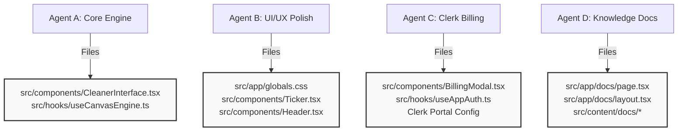

<!-- BEGIN:nextjs-agent-rules -->
# This is NOT the Next.js you know

This version has breaking changes — APIs, conventions, and file structure may all differ from your training data. Read the relevant guide in `node_modules/next/dist/docs/` before writing any code. Heed deprecation notices.
<!-- END:nextjs-agent-rules -->

# ScrubAI — Multi-Agent Developer Matrix

To support efficient parallel development by multiple concurrent AI agents, the following roles, code boundaries, and tasks have been partitioned. Follow these limits strictly to avoid file intersections and merge conflicts.

---

## 🗺️ Workspace Boundaries Map

---

## 🛠️ Role Definitions & Task Checklists

### 🧑‍💻 Agent A: Core Image Processing & Formats
* **Primary Scope:** Client-side canvas operations, image analysis engines, and file export pipelines.
* **Target Files:**
  * `src/components/CleanerInterface.tsx` (Internal canvas hooks and drop zones)
* **Assigned Tasks:**
  - [ ] **HEIC/HEIF Input Conversion:** Integrate client-side conversion libraries (e.g. `heic2any` dynamic imports) to support mobile iOS image format uploads.
  - [ ] **Export Compression Sliders:** Add a quality slider (0.1 to 1.0) allowing professional creators to choose between high-fidelity lossless PNG conversions or highly-compressed lightweight JPEGs.
  - [ ] **Canvas Resizing Options:** Implement a preset selector to auto-downscale files to standard social media resolutions (e.g. 1080p, 4K) to optimize load speed and destroy resizing metadata artifacts.

---

### 🎨 Agent B: Premium Aesthetics & Micro-interactions
* **Primary Scope:** Theme styling tokens, scroll speeds, visual double-ruled frames, and drop animations.
* **Target Files:**
  * `src/app/globals.css` (Tailwind styles, scrolling ticker keyframes)
  * `src/components/Ticker.tsx` (Endless statistics tracks)
  * `src/components/Header.tsx` (Theme toggle layouts)
* **Assigned Tasks:**
  - [ ] **Marquee Speed Options:** Add a scroll-speed config option to the metric ticker (normal, slow, hyper-fast).
  - [ ] **Interactive Drag Animations:** Refine dropzone borders with a pulsing double-dashed overlay and custom hover drop states.
  - [ ] **Premium Typography Kernings:** Adjust font spacing matching strict editorial newsprint layouts on wide screens.

---

### 💳 Agent C: Clerk Billing & Gates Integration
* **Primary Scope:** Interactive payment flows, subscriber gates, plan metadata, and modal popups.
* **Target Files:**
  * `src/components/BillingModal.tsx` (Subscription plans options)
  * `src/hooks/useAppAuth.ts` (Mock & Live auth flows)
  * `src/app/dashboard/page.tsx` (Tier actions)
* **Assigned Tasks:**
  - [ ] **Clerk Billing Setup:** Configure Clerk billing settings in the Clerk Dashboard and sync plans.
  - [ ] **Modal Tiers Dynamic Mapping:** Populate real pricing links pointing to Clerk Stripe portal checkouts.
  - [ ] **User Upgrade Refresh Logic:** Refine automatic page state refreshes when a user updates from Free to Pro while keeping their current file queue intact in context.

---

### 📖 Agent D: Privacy Docs & Technical briefing
* **Primary Scope:** Contextual documentation regarding metadata vulnerabilities, social site SUPPRESSIONS, and C2PA bypass steps.
* **Target Files:**
  * `src/app/docs/` [NEW] (Static documentation routes)
  * `src/content/` [NEW] (Content files)
* **Assigned Tasks:**
  - [ ] **Create Reach Penalties Guide:** Write a detailed editorial guide explaining why platforms like Instagram and Pinterest filter metadata-linked AI exports.
  - [ ] **Explain Annihilation Math:** Document how pixel redrawing differs from traditional metadata-stripping, validating security credentials.
  - [ ] **Implement Client-Side Document Search:** Build a fast client-side filters pane for the docs directory.
