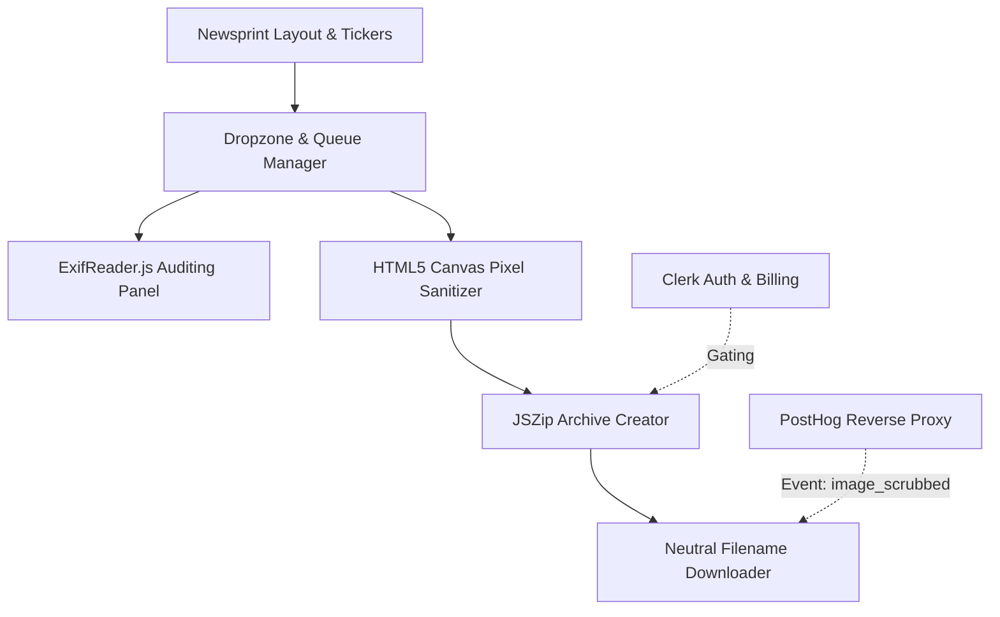

# ScrubAI Implementation Plan

ScrubAI is a high-performance, local-first (browser-only) AI Metadata Cleaner. Its core mission is to strip metadata (EXIF, IPTC, XMP, and cryptographically signed C2PA / "Content Credentials") from images. This helps photographers, designers, and bloggers bypass platform suppression and false-positive "Made with AI" labels.

This plan details how we will bootstrap the Next.js (App Router) application, configure authentication, billing, analytics, and client-side canvas processing, all while preserving the high-end, premium, double-ruled **Newsprint Design System** from `acme-inc.html`.

---

## User Review Required

> [!IMPORTANT]
> To run the completed app in production, you will need to set up the following:
> 1. **Clerk Application**: Create an account on [Clerk](https://clerk.com/) and copy your API Keys (`NEXT_PUBLIC_CLERK_PUBLISHABLE_KEY` and `CLERK_SECRET_KEY`) to the `.env.local` file.
> 2. **Clerk Billing**: Enable Clerk Billing in the Clerk dashboard and connect a Stripe account. Set up your two plans:
>    - **Pro Tier (Monthly)**: $5/month. Includes batch processing (up to 50 images at once) and ZIP exports.
>    - **Lifetime Tier**: $20 one-time. Includes same Pro features forever.
> 3. **PostHog Project**: Create a PostHog account, get your project API key (`NEXT_PUBLIC_POSTHOG_KEY`), and add it to `.env.local`.

---

## Open Questions

> [!NOTE]
> 1. **Dark Theme vs. Light Theme**: The reference HTML is a light-themed newsprint design (cream background, charcoal text). The prompt mentions: *"Ensure Tailwind config handles the colors (dark theme preference)"*.
>    - We propose implementing **both**! We will configure the theme with CSS variables. By default, the application will adapt beautifully based on user system preferences (`prefers-color-scheme`) or a header toggle, rendering an elegant **Dark Newsprint** (charcoal background, cream text, glowing crimson accent) or **Classic Newsprint** (cream background, charcoal text, bold crimson accent).
> 2. **Demo / Sample Images**: For the metadata audit panel and file sanitization demonstration, should we bundle a sample image with pre-configured EXIF data so users can test immediately without uploading?
>    - *Yes*, we will provide a built-in mock button "Use Sample Image" so the user can test the auditing panel instantly!

---

## Proposed Changes

We will build the Next.js application inside the root of our workspace `d:\Programming\web dev\aimetadatacleaner`.

### Next.js Core Setup

#### [NEW] [next.config.js](file:///d:/Programming/web%20dev/aimetadatacleaner/next.config.js)
Contains configuration for PostHog reverse proxy rewrites to bypass ad-blockers:
- Rewrites `/ingest/static/:path*` to `https://us-assets.i.posthog.com/static/:path*`
- Rewrites `/ingest/:path*` to `https://us.i.posthog.com/:path*`
- Rewrites `/ingest/decide` to `https://us.i.posthog.com/decide`

#### [NEW] [.env.local](file:///d:/Programming/web%20dev/aimetadatacleaner/.env.local)
Stores Clerk API keys, PostHog key, and dev environment flags.

#### [NEW] [middleware.ts](file:///d:/Programming/web%20dev/aimetadatacleaner/src/middleware.ts)
Configures Clerk Route Protection:
- `/` is fully public (marketing page, pricing, footer, single-image scrubbing).
- `/dashboard` is protected, requiring authentication to access advanced stats or Clerk Billing pricing settings.

#### [NEW] [tailwind.config.ts](file:///d:/Programming/web%20dev/aimetadatacleaner/tailwind.config.ts)
Extends Tailwind with the custom fonts and color tokens from the reference HTML:
- Colors: `bg`, `ink`, `muted`, `accent` map to CSS variables for dark-mode flexibility.
- Fonts: `Playfair Display` (serif), `Lora` (body), `Inter` (sans), `JetBrains Mono` (monospace).

#### [NEW] [src/app/globals.css](file:///d:/Programming/web%20dev/aimetadatacleaner/src/app/globals.css)
Injects core design system tokens (CSS variables) for both light and dark modes, keyframes for the endless ticker tape animations (`@keyframes tick`), drop cap rules, and the premium 4x4 SVG grid background pattern.

---

### Core Components

#### [NEW] [src/app/providers.tsx](file:///d:/Programming/web%20dev/aimetadatacleaner/src/app/providers.tsx)
Sets up client-side provider wrappers for `ClerkProvider` and PostHog (`posthog-js` initialization with API key and dynamic ingestion host `/ingest` to guarantee anti-adblock support).

#### [NEW] [src/components/Ticker.tsx](file:///d:/Programming/web%20dev/aimetadatacleaner/src/components/Ticker.tsx)
An endless scrolling marquee that showcases real-time statistics (Active users, uptime, files scrubbed, data weight saved).

#### [NEW] [src/components/Header.tsx](file:///d:/Programming/web%20dev/aimetadatacleaner/src/components/Header.tsx)
Sticky navigation header. Features standard typography, brand logo with accented period, "Vol. 1" edition badge, responsive links, theme toggle, and Clerk `<UserButton />`.

#### [NEW] [src/components/MetadataAuditor.tsx](file:///d:/Programming/web%20dev/aimetadatacleaner/src/components/MetadataAuditor.tsx)
The metadata parsing component. Uses `exifreader` to parse the file buffer. Renders a stunning "Auditing Panel" (like a news briefing) showing camera specs, editing software, and active C2PA cryptomarker signatures.

#### [NEW] [src/components/CleanerInterface.tsx](file:///d:/Programming/web%20dev/aimetadatacleaner/src/components/CleanerInterface.tsx)
The central app dashboard engine:
- **Dropzone**: Responsive drag-and-drop workspace that adapts when images are loaded.
- **HTML5 Canvas Sanitizer**: Draws image files onto an offline canvas and exports back to PNG/JPEG, wiping 100% of standard metadata, EXIF, and C2PA markers.
- **Generic Filenames**: Toggle to replace names like `DALL-E 2026-05-23...` with randomized neutral hashes.
- **Queue Manager & Batching**: Lists files being processed.
- **Gatekeeper**: Checks Clerk `user.publicMetadata` or Clerk Billing permissions. If a Free user tries to batch multiple files or exceed 1 file, it triggers the Billing modal.

#### [NEW] [src/components/BillingModal.tsx](file:///d:/Programming/web%20dev/aimetadatacleaner/src/components/BillingModal.tsx)
A gorgeous newsprint-themed dialog that locks the Pro ZIP/batch operations behind Clerk Billing. Embeds Clerk `<PricingTable />` or custom upgrade details.

---

### Pages and Layouts

#### [NEW] [src/app/layout.tsx](file:///d:/Programming/web%20dev/aimetadatacleaner/src/app/layout.tsx)
Loads Google Fonts and builds the global shell around components with responsive padding and the grid background.

#### [NEW] [src/app/page.tsx](file:///d:/Programming/web%20dev/aimetadatacleaner/src/app/page.tsx)
The unified marketing & core app experience. Maps the beautiful pricing cards, testimonial quotes, newsletter fields, and FAQs directly from the template.

#### [NEW] [src/app/dashboard/page.tsx](file:///d:/Programming/web%20dev/aimetadatacleaner/src/app/dashboard/page.tsx)
The private workspace for upgraded users, displaying advanced batch cleaning records and user subscription management details.

#### [NEW] [src/app/robots.txt](file:///d:/Programming/web%20dev/aimetadatacleaner/src/app/robots.txt) & [sitemap.ts](file:///d:/Programming/web%20dev/aimetadatacleaner/src/app/sitemap.ts)
Automated SEO structures.

---

## Verification Plan

### Automated Tests & Correctness
1. Run `npm run build` to ensure zero compilation or linter errors inside the TypeScript App Router setup.
2. Verify Next.js routing, checking that requests to `/ingest` rewrite properly to PostHog's endpoints.

### Manual Verification Flow
1. **Drag and Drop / Upload File**:
   - Upload an image containing active metadata tags.
   - Assert the Audit Panel immediately extracts and displays GPS coordinates, software, camera model, etc.
2. **Metadata Annihilation**:
   - Sanitize the image.
   - Download the sanitized output.
   - Re-upload the output to verify all fields are completely blank/clean.
3. **Toggle Randomized Filenames**:
   - Check if toggling yields a neutral `img_xxxx.png` signature.
4. **Billing & Gating**:
   - Attempt to upload 3 images as a non-authenticated/Free user.
   - Assert a modal appears gating the ZIP and batch features.
   - Authenticate/Simulate a purchase and check that the batch process runs, compiles a JSZip instance, and downloads successfully.
5. **PostHog Analytics Events**:
   - Inspect network traffic under browser devtools to verify `image_scrubbed` events successfully ingest to `/ingest` with custom properties.
